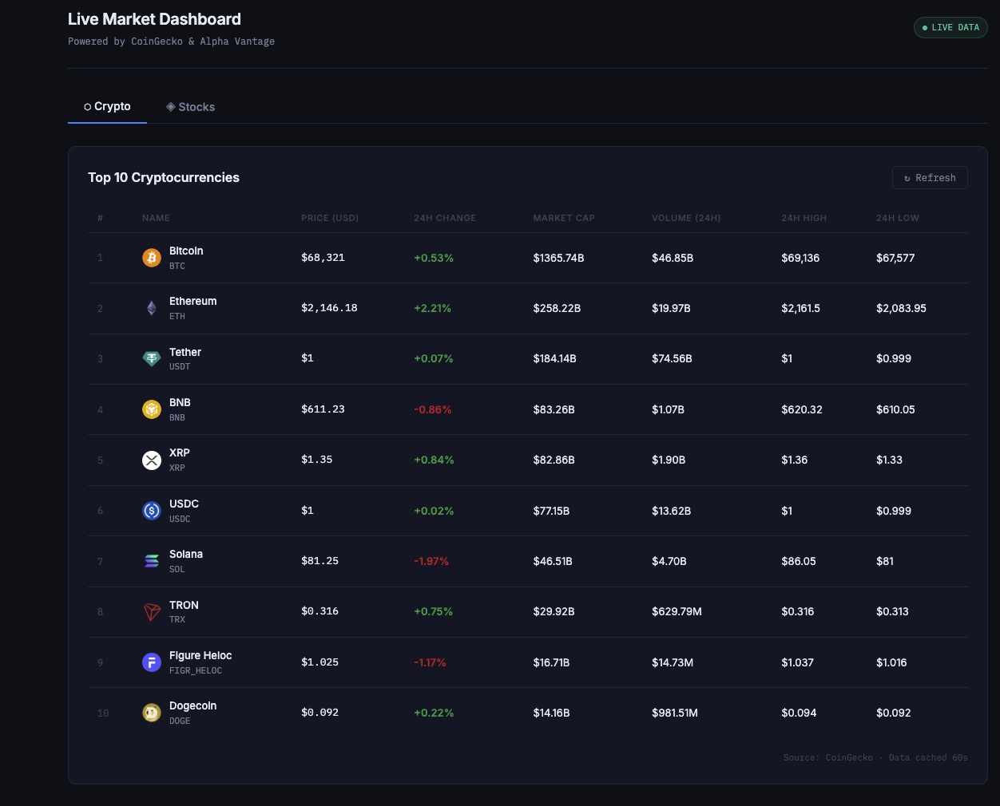
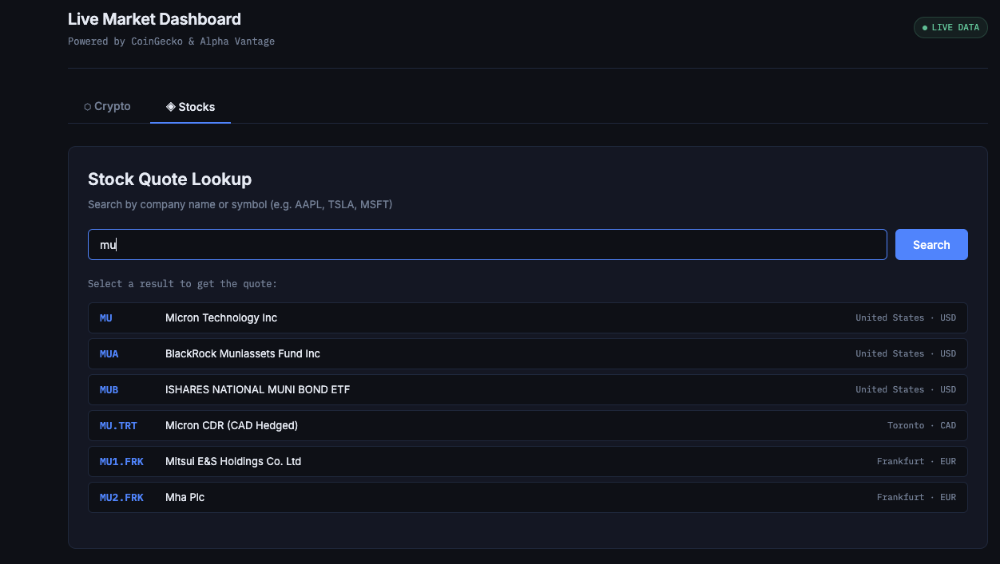
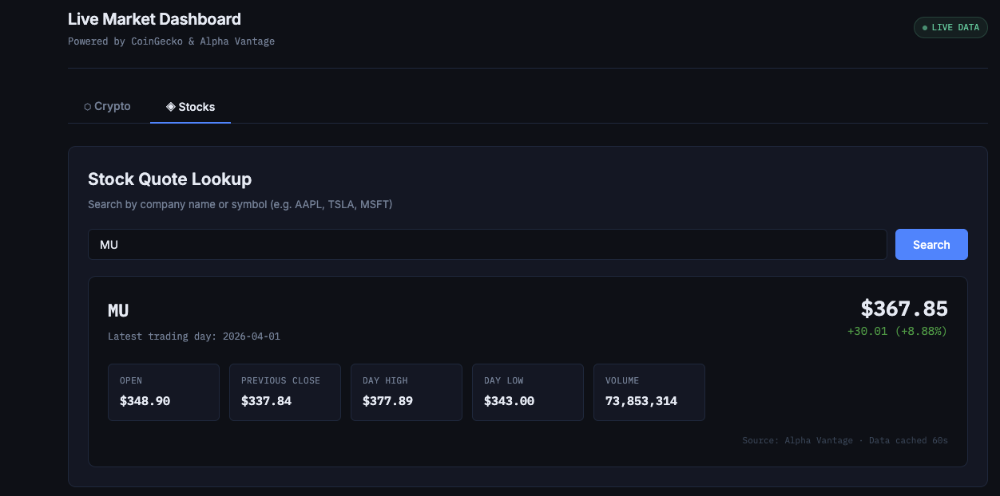

A full-stack live market dashboard that aggregates real-time cryptocurrency and stock data from public APIs. 
Built with a Spring Boot backend (Java 21) and a React + Vite frontend.
Live Link: coming soon
API docs: coming soon

## Screenshots

Crypto Tab

Stock Tab 

## Features:
- **Top 10 Cryptocurrencies ranked by market cap, with 24h price change, volume, and highs/lows — sourced from CoinGecko (no API key required)**
- **Stock Quote Lookup** — search any symbol or company name and get a real-time global quote from Alpha Vantage 
- **Server-side caching with Caffeine (60s TTL)** — avoids rate-limiting on both APIs
- **Clean DTO layer separating internal deserialization models from frontend-facing responses**
- **CORS configured for local development with Vite proxy passthrough**
- **Global exception handling with structured JSON error responses**

## Tech Stack
- **Backend**: Java 21, SpringBoot 3.5.13, Spring Web, Spring Cache
- **Caching**: Caffeine
- **HTTP Client**: Spring RestTemplate
- **Frontend**: React 19, Vite 8
- **Charts**: Recharts
- **External APIs**: CoinGecko for Crypto, Alpha Vantage free API Key for stocks
- **API Docs**: Springdoc OpenAPI

## Project Structure
market-dashboard/
├── backend/
│   ├── pom.xml
│   └── src/main/
│       ├── resources/
│       │   └── application.properties
│       └── java/com/market_dashboard/
│           ├── MarketDashboardApplication.java
│           ├── config/         AppConfig.java (CORS, RestTemplate, CacheManager)
│           ├── model/          CryptoSummary.java · StockQuote.java
│           │                   StockSearchResult.java · ApiResponse.java
|           |dto/               CryptoDTO.java 
│           ├── service/        CryptoService.java · StockService.java
│           └── controller/     CryptoController.java · StockController.java
|           |exception/         GlobalExceptionHandler.java
└── frontend/
    ├── index.html
    ├── vite.config.js          (proxy /api → :8080)
    └── src/
        ├── api/        marketApi.js
        ├── hooks/      useFetch.js
        └── components/ CryptoTable.jsx · StockLookup.jsx
## API Endpoints
GET /api/crypto/top?limit=10  Top N coins by market cap with 10 as a default limit
GET /api/crypto/{coinId}     Single coin detail by CoinGecko ID (eg: bitcoin, ethereum)
GET /api/stocks/quote/{symbol}   Real-time global quote (eg: AAPL, MSFT)
GET /api/stocks/search?q={keyword} Symbol search by company name or ticker

