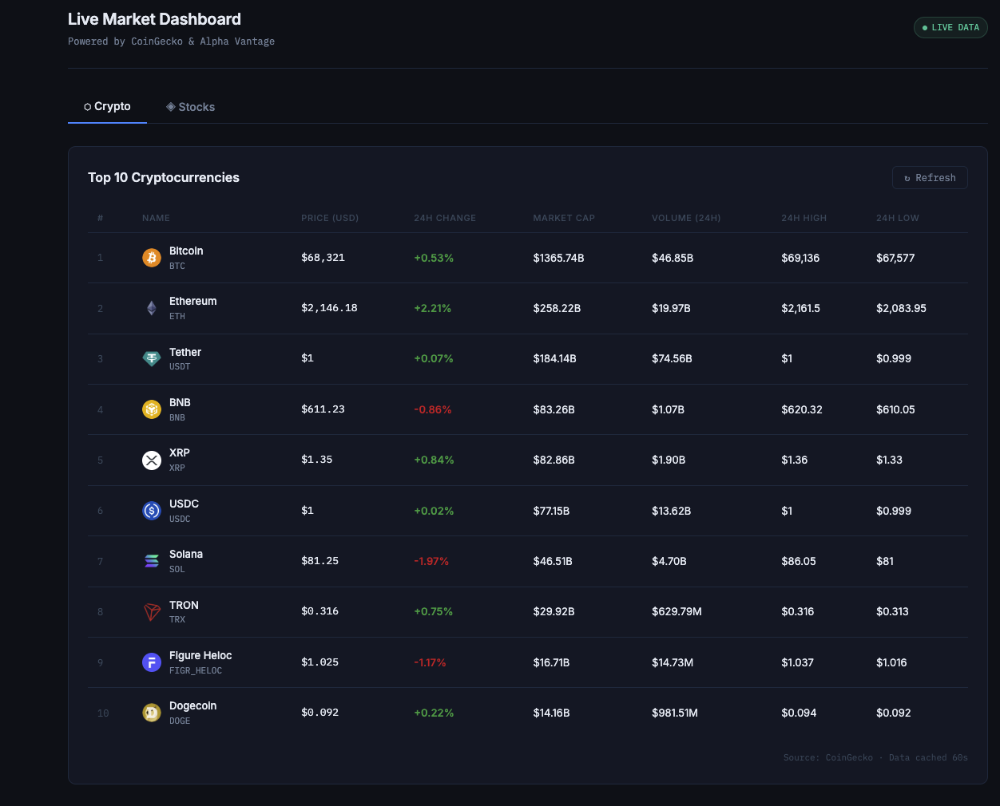
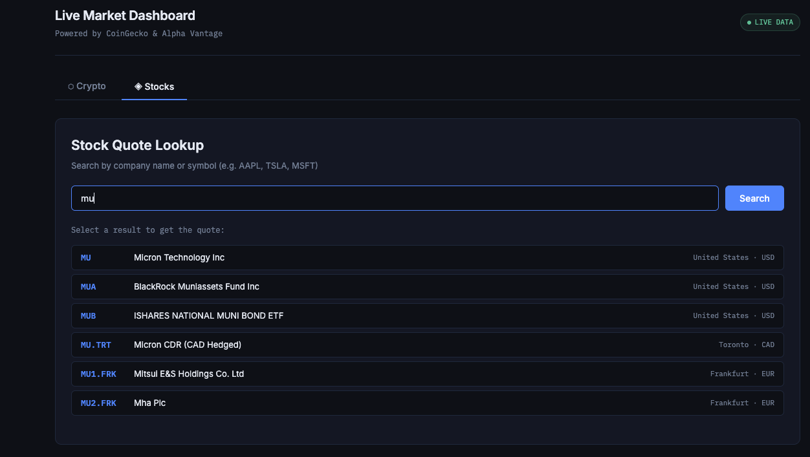
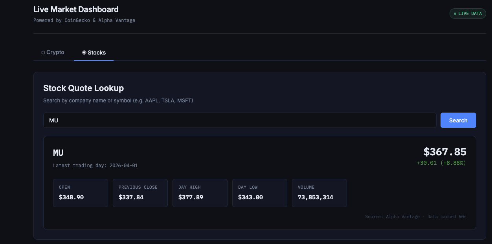

A full-stack live market dashboard that aggregates real-time cryptocurrency and stock data from public APIs. 
Built with a Spring Boot backend (Java 21) and a React + Vite frontend.

## Live Link: coming soon

## Screenshots

Crypto Tab

Stock Search Tab 

Stock Quote Tab

## Features:
- **Top 10 Cryptocurrencies ranked by market cap, with 24h price change, volume, and highs/lows — sourced from CoinGecko (no API key required)**
- **Stock Quote Lookup** — search any symbol or company name and get a real-time global quote from Alpha Vantage 
- **Server-side caching with Caffeine (60s TTL)** — avoids rate-limiting on both APIs
- **Clean DTO layer separating internal deserialization models from frontend-facing responses**
- **CORS configured for local development with Vite proxy passthrough**
- **Global exception handling with structured JSON error responses**

## Tech Stack
- **Backend**: Java 21, SpringBoot 3.5.13, Spring Web, Spring Cache
- **Caching**: Caffeine
- **HTTP Client**: Spring RestTemplate
- **Frontend**: React 19, Vite 8
- **Charts**: Recharts
- **External APIs**: CoinGecko for Crypto, Alpha Vantage free API Key for stocks
- **API Docs**: Springdoc OpenAPI

## API Endpoints
- **GET /api/crypto/top?limit=10**  Top N coins by market cap with 10 as a default limit
- **GET /api/crypto/{coinId}**    Single coin detail by CoinGecko ID (eg: bitcoin, ethereum)
- **GET /api/stocks/quote/{symbol}**   Real-time global quote (eg: AAPL, MSFT)
- **GET /api/stocks/search?q={keyword}** Symbol search by company name or ticker

## Getting Started
1. (Initial set up) You will need to have the following dependencies = Spring Cache, Web, DevTools Caffeine, Lombok, Springdoc (OpenAPI), Starter Test
2. Running the backend app from Terminal = ./mvnw spring-boot:run -Dmaven.test.skip=true
3. To run the frontend start by navigating to the frontend folder n your Terminal = cd frontend
4. Then install the library files and create the vite project = npm create vite@latest frontend and then npm install to install the files
5. To run the react app = npm run dev
6. To visualize the dashboard (make sure backend is running)= click and open the link http://localhost:5173

